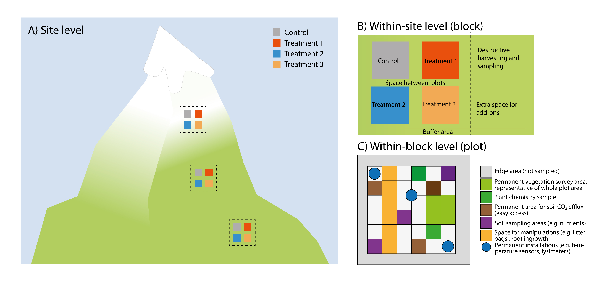

``` {r setup, include=FALSE}
knitr::opts_chunk$set(echo = FALSE)

library(tidyverse)
library(kableExtra)
library(gt)
```


## Optimising the study design

### What to measure and report and why?

A basic site description for an experimental or observational site includes the location where the study was performed and under what biotic and abiotic conditions. The documentation of the basic characteristics of the system and correct reporting of the basic data facilitates and improves comparisons with other studies and downstream usage of the data in meta-analyses and other data syntheses (Hillebrand & Gurevitch, 2013; Haddaway & Verhoeven, 2015; Gerstner et al., 2017). For any study it is thus important to report and measure the following information for each site: i) geographical location and basic site description, ii) abiotic and biotic properties of the ecosystem, iii) basic climate and weather data, and iv) experimental set-up, analysis, and results. More specific for climate-change experiments _sensu stricto_, variables that may be influenced by the manipulation need to be measured in all treatments. These include variables such as soil moisture, temperature, and nutrient availability, along with various biotic responses described in detail in other protocols (Supporting Information 2 [Carbon and nutrient cycling], 3 [Water cycling], 4 [Species and interactions] and 5 [Stress physiology]). For _in situ_ experiments (e.g. space and time), it is important to measure variables that may be influenced by the spatial or temporal component of the experiment.

The **geographical location and basic site description** should describe the study location i.e. coordinates, vegetation type, and climate (Hillebrand & Gurevitch, 2013; Morueta-Holme et al., 2018). This effort enables and facilitates further upscaling and modelling of the experiments beyond the observational boundary as well as increasing the potential for the dataset to be used in meta-analysis.

The pre-treatment measurements of the **abiotic and biotic properties** of the ecosystem report the conditions of the soil–plant–atmosphere system before the experimental manipulation (i.e. baseline ecosystem measurements) and enables between-experimental site comparisons in a global context. It is crucial to measure these key variables before the manipulations start in order to evaluate changes imposed by ambient, non-manipulated environmental conditions. Similarly, for natural experiments and long-term monitoring, baseline data (e.g. pre- and/or post-observational measurements) are important. The key variables that should be reported are of a physical, chemical, and biological nature, and also concern ecosystem services (e.g. water quality, carbon and nutrient cycling, biodiversity; Costanza et al., 1997). They are also important for process modelling and data usage in a meta-analysis. In addition to the before-after treatment measurements, it is advisable to have plots in the experimental design that test control vs. impact (Christie et al. 2019).

When conducting a climate-change study, it is crucial to measure **environmental conditions** during the study and if applicable in every treatment as these potential drivers of ecosystem functioning may deviate substantially from ambient conditions, and treatments may have effects on other drivers, such as warming leading to changes in the water balance (Damgaard et al., 2018). The most important climate variables include air temperature, relative humidity, and precipitation (which may be in the form of irrigation or precipitation removal), as well as soil temperature and moisture.

Finally, for the further use of the data from a climate-change studies, i.e. for a meta-analysis, it is crucial to correctly follow open science practise and report the study design, analysis, and results (Hillebrand & Gurevitch, 2013; Haddaway & Verhoeven, 2015; Gerstner et al., 2017).

### Setting up a sustainable climate-change study

Once a decision on the important matters in the research are made, such as the research question, the experimental treatments and study design, the study system, site selection, and other important issues related to the research (which is not the purpose of this protocol and will not be discussed here), a number of more practical issues have to be decided. Climate-change studies are expensive and resource demanding and the goal should be to make the most out of them. One of the most important decisions is that of sustainability: how long will the study last, how many people and how much activity will be involved, and is there any chance that there will be new projects and measurements coming in? As a general rule of thumb, there is little to lose by erring on the side of optimism (as in expecting a lot of activity), although financial and spatial constraints may, of course, limit the options. Some general advice to guide decision-making is offered in Table \@ref(tab:checklist) and Figure \@ref(fig:nested-study-design).

```{r nested-study-design, fig.cap="Schematic figure of an example of a nested climate-change study design with four different levels: A) site, B) within-site (block), and C) within-block and plot level (plot and sub-plot).", out.width='100%'}

```

### At which spatial scale should you measure?

The scale at which a variable should be measured has to be considered carefully. Measurements can be quick and simple or labour-intensive and expensive. Most importantly, the scale of the measurements should depend on the research question and the study system, but here are some general rules that are widely applicable, unless there are strong reasons to do differently related to the research questions or study design:

*   Generally, all variables that are stable across the site and that are not affected by the experiment within the timeframe of the study should be measured at the site scale.
*   Conversely, variables that are influenced by the experimental treatments should be measured at the plot scale.
*   Variables that vary across the site should preferably be measured at the block or plot scale.

In practice, many of these decisions will be affected by economic and data analysis considerations, and there is likely to be a choice between expensive installations/optimal measurements with low replication (i.e. in some but not all treated plots) v. using cheaper/simpler measurements and technology which may allow measuring it across all replicates in the experiments. However, cheap technology and smaller and better loggers are developing rapidly, offering new opportunities. In heterogeneous habitats (horizontal and vertical), it is advisable to measure variables in several places.

### What is the ideal sampling interval?

Similar considerations should be made for the sampling intervals. The frequency of the sampling will mainly depend on the temporal resolution of interest (annual variation, seasonal patterns, daily fluctuations) and also on whether manual sampling or automated loggers are used. If the data are used for modelling, it is important to consider the required temporal resolution of the model, which is often on a fine scale. For example, modelling of ecosystem gas exchange will require half-hourly to hourly climate data input. The calculation of some long-term variables such as seasonal temperature sums or daily maxima also requires relatively high-resolution data. Also here, rapid improvements in technology open up opportunities.

```{r checklist}
    
tribble(
    ~"Scale", ~"Question", ~"Guidance",
    
    "**Site (selection)** <br><br> Figure 1.1A", "What does the system represent? <br><br> Which environment, habitat, ecosystem, former and present land use? <br><br> Are there any specific factors like off-site effects (run-off, shade, nutrient inputs etc.) to consider?", "Sites should be placed within the limits of the relevant system, avoiding off-site effects when possible. Please note if former land use only affects part of the study area <br><br> Blocks (or other study design features) should be chosen to capture within-site heterogeneity due to environmental or biotic variability, or off-site effects.",
    
    "", "Single-site or multi-site study? <br><br> Is the interest in the treatment effects per se, or across site comparisons of these effects? <br><br> Are there other reasons for replicating across sites such as generality of the response, relevance across several systems etc.?", "**Single-site studies** are easier and cheaper to maintain, allowing resources to be spent on experimental factors and response variables.  **Multiple-site studies** allow across site comparisons, but it is then important to consider your “outer design”, i.e. should sites be along gradients or replicates in similar environmental settings, how many replicates are needed (e.g. to fit a regression at site level), etc. <br><br> Multi-site studies increase the costs and effort, but these also depend on the study and location of the different sites.",
    
    "", "Are any **permits** necessary and contacts to ensure site sustainability?", "Obtain permits from the government and landowners well in advance.  Ideally get permits beyond the funding period for potential extension of the study.",
    
    "", "Is any site-scale **maintenance** needed? Fencing, grazing, mowing? <br><br> Any control needed for that?", "Building a fence and moving might need the agreement of the landowner. <br><br> Calculate enough time and money for maintenance. <br><br> If the site maintenance affects your responses, you might need (yet) another set of controls.",
    
     "", "What **site-scale data** are needed? <br><br> How many measurements are needed?", "Report all the information needed to situate your study in space, time, and in the relevant ecological context. If you have a heterogeneous system, you likely need more than one measuring point in space (horizontal and vertical) and time. <br><br> Any variables affected by the experimental treatments need monitoring on a finer scale (see below) <br><br> Draw detailed maps of your study site with all blocks, plots, and installations clearly indicated <br><br> Take pictures; they are essential to document study set-up and design, for data collection (e.g. relocating samples), and outreach, and can be useful for data quality checks.",
    
    
    "**Within-site study design (blocks)** <br><br> Figure 1.1B", "How to ensure **sustainable site set-up**?", "The area should be large enough to accommodate the study, treatments and the necessary unmanipulated controls / sampling areas for site-level factors. <br><br> The site set-up should provide space (buffer area) to avoid contamination of for example treatments, and between blocks to carry out the measurements. In sensitive systems or when plots are small, consider installing boardwalks, etc. to minimise disturbance. A central pole supporting a ladder can be used in small plots to reach every point without touching the ground. <br><br> The potential observer effects should always be considered and can be reduced by minimising disturbance, i.e. sampling intensely but not at the expense of statistical power (De Boeck et al., 2008).",
    
    "", "What **block-scale data** is needed?", "Any response, predictor or co-variable that will be used in statistical analyses should be measured at this scale, if at all possible. This maximises the statistical power of the analyses.",
    
    "", "Is there space for **additional experiments and/or measurements**?", "Set aside areas for add-on measurements and project extensions - preferably within blocks, as that maximises opportunities for project integration.",
    
    
    "**Within-block study design (plots)** <br><br> Figure 1.1C", "How to ensure **sustainability of studies in plot set-up**? <br><br> Where are data measured permanently and where destructively?", "Plots should be large enough to encompass the responses of interest, and thus have to match the study aim and study system. The plot size should also take into account the complexity and heterogeneity of the study system (De Boeck et al., 2015). Plots should be large enough for sensor installation and sampling. <br><br> It is recommended to divide the plots into destructive and non-destructive sampling areas. <br><br> Permanently mark and map all plots and sub-areas within plots individually, and include back-up marking (e.g. buried metal nails, or similar) in case primary marking is lost. A standardised (systematic) marking and within-plot design regime is easier to relocate if lost.",
        "", "What **plot-scale data** are needed?", "All variables that are **directly affected by a treatments** should be measured at the plot scale. <br><br> It is advisable to have different **control plots** that control for before-after treatment effects and control vs. impact during the experiment (Christie et al. 2019). <br><br> Pictures of the plots at each sampling date are useful as they document the data collection and can also provide various kinds of additional data.",
    
    "**Within-plot study design (sub-plot, sample)** <br><br> Figure 1.1C", "Where are data measured **permanently** and where **destructively**? <br><br> What **sub-plot data** are needed?", "Sub-plots can be used for dividing plots into zones, for **destructive, non-destructive sampling**. <br><br> Sub-plots can also be used directly for sampling purposes, e.g. **frequency data** or mapping. <br><br> Sensors and non-intrusive measurements can be installed in and under the permanent sub-plots, e.g. lysimeters, mini-rhizotron. <br><br> Sub-plot data can be used directly in data analyses, and they are very useful for data checking, i.e. when resampling the same sub-plot over time, data from different time steps can be compared. <br><br> In destructive sampling: plug soil-sampling holes with soil from within the block to avoid drainage issues and mark them to avoid resampling."
    ) |> 
  gt(caption = "Checklist of questions to ask and guidance when setting up a sustainable and multi-purpose climate-change study from site to sub-plot level.") |> 
  tab_style(style = "vertical-align:top", locations = cells_body(columns = vars(Scale, Question, Guidance))) |> 
  fmt_markdown(columns = everything())

```


### References

Costanza, R., d’Arge, R., de Groot, R., Farber, S., Grasso, M., Hannon, B., … van den Belt, M. (1997). The value of the world’s ecosystem services and natural capital. _Nature, 387_, 253-260.

Christie, A. P., Amano, T., Martin, P. A., Shackelford, G. E., Simmons, B. I., & Sutherland, W. J. (2019). Simple study designs in ecology produce inaccurate estimates of biodiversity responses._bioRxiv_, 612101.

Damgaard, C. F., Holmstrup, M., Schmidt, I. K., Beier, C., & Larsen, K. S. (2018). On the problems of using linear models in ecological manipulation experiments: lessons learned from a climate experiment. _Ecosphere, 9_(6), e02322.

De Boeck, H. J., Liberloo, M., Gielen, B., Nijs, I., & Ceulemans, R. (2008). The observer effect in plant science. _New Phytologist, 177_(3), 579–583.

De Boeck, H. J., Vicca, S., Roy, J., Nijs, I., Milcu, A., Kreyling, J., … Beier, C. (2015). Global change experiments: Challenges and opportunities. _Bioscience, 65_(9), 922–931.

Gerstner, K., Moreno-Mateos, D., Gurevitch, J., Beckmann, M., Kambach, S., Jones, H. P., & Seppelt, R. (2017). Will your paper be used in a meta-analysis? Make the reach of your research broader and longer lasting. _Methods in Ecology and Evolution, 8_(6), 777–784.

Haddaway, N. R., & Verhoeven, J. T. A. (2015). Poor methodological detail precludes experimental repeatability and hampers synthesis in ecology. _Ecology and Evolution, 5_(19), 4451–4454.

Hillebrand, H., & Gurevitch, J. (2013). Reporting standards in experimental studies. _Ecology Letters, 16_(12), 1419–1420.

Morueta-Holme, N., Oldfather, M. F., Olliff-Yang, R. L., Weitz, A. P., Levine, C. R., Kling, M. M., … Ackerly, D. D. (2018). Best practices for reporting climate data in ecology. _Nature Climate Change, 8(_2), 92–94.
