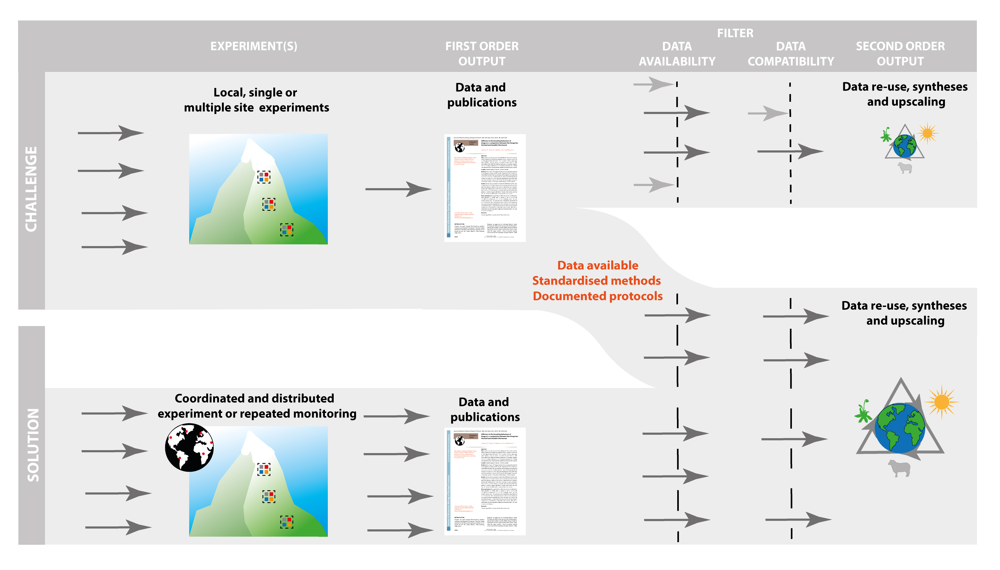

```{r, echo=FALSE}
knitr::opts_chunk$set(echo = FALSE)
#, warning = FALSE, error = TRUE
```


# The ClimEx Handbook {-}

## The Aim {-}

Climate change is a worldwide threat to biodiversity and ecosystem structure, functioning, and services. To understand the underlying drivers and mechanisms, and to predict the consequences for nature and people, we urgently need better understanding of the direction and magnitude of climate-change impacts across the soil–plant–atmosphere continuum.

An increasing number of climate-change studies is creating new opportunities for meaningful and high-quality generalisations and improved process understanding. However, significant challenges exist related to data availability and/or compatibility across studies, compromising opportunities for data re-use, synthesis, and upscaling. Many of these challenges relate to a lack of an established “best practice” for measuring key impacts and responses. This restrains our current understanding of complex processes and mechanisms in terrestrial ecosystems related to climate change.

```{r, out.width='100%', fig.cap="Challenges and solutions to the integration of information from first-order outputs of individual experiments or observational studies (i.e. the original data and publications) to second-order research outputs resulting from, for example meta-analyses, reviews and modelling (i.e. data re-use, synthesis and upscaling). The figure illustrates the major challenges to achieve such second-order outputs, summarized as two filters (dashed lines) relating to data availability and data compatibility across studies. Two general approaches to solve these challenges exist; either using formally coordinated and distributed experiments or using standardized methods, sampling protocols and reporting across individual and independent studies. The aim of this paper is to contribute to the latter approach by offering guidance on selection of response variables, protocols for standardized measurements of these variables and advice on data reporting and management in climate change studies"}

```


To overcome these challenges, we collected best-practice methods emerging from major ecological research networks and experiments, as synthesised by 115 experts from across a wide range of scientific disciplines. Our handbook contains guidance on the selection of response variables for different purposes, protocols for standardised measurements of 66 such response variables, and advice on data management. Specifically, we recommend a minimum subset of variables that should be collected in all climate-change studies to allow data re-use and synthesis, and give guidance on additional variables critical for different types of synthesis and upscaling.

The goal of this community effort is to facilitate awareness of the importance and broader application of standardised methods to promote data re-use, availability, compatibility, and transparency. We envision improved research practices that will increase returns on investments in individual research projects, facilitate second-order research outputs, and create opportunities for collaboration across scientific communities. Ultimately, this should significantly improve the quality and impact of the science, which is required to fulfil society’s needs in a changing world.


## Issue Tracker {-}

We want to ensure that the ClimEx Handbook will also be a useful resource for the community in the future. 
Comments and suggestions for updating the protocols are welcome and can be made here.

The comments and suggestions will be assessed by the authors of the ClimEx Handbook periodically, and it might take some time before you hear back from us. 
All the changes and updates that are made to the protocols are track changed via our [GitHub repository](https://github.com/ClimExHandbook/ClimExHandbook/issues).


## About Us {-}


### Who We Are {-}

The ClimEx Handbook was written by 115 scientists from 21 countries on four continents. See individual protocols for the detailed author list.

The ClimEx Handbook developing team consists of:

**Aud H. Halbritter**
I'm the editor of the ClimEx handbook and webpage. My research interests are global change and ecosystem ecology. I work in alpine areas and use large-scale experimental, trait-based and gradient approaches. Currently, I am working on the THREE-D project, studying the effects on warmer climate, nitrogen deposition and grazing on biodiversity and carbon cycling in grasslands.

**Vigdis Vandvik**

**Hans De Boeck**
I'm a researcher at the University of Antwerp, and was editor of chapter 5 of this handbook (stress physiology). My research field is global change ecology, with a focus on effects of climate change and climate extremes on the functioning of terrestrial ecosystems, and modulation of impacts by ecosystem characteristics (biodiversity, composition, etc.). I'm involved in AnaEE, which connects experimental research platforms in Europe.

**Anke Jentsch-Beierkuhnlein**
I am a professor of disturbance ecology and vegetation dynamics at the University of Bayreuth in Germany and one of the main authors of the ClimEx Handbook. My experimental research focusses on the effects of climate extremes on biodiversity and ecosystem functions, and I am leading the chapter on species and interactions. With my research site representing temperate grassland I participate in several collaborative, distributed, ecological experiments in ecology such as DroughtNet, NutNet, HerbDivNet, SIGNAL and SUSALPS.

**Klaus Steenberg Larsen**
I am associate professor at the University of Copenhagen with a research focus on effects of climate change on carbon and nitrogen cycling in ecosystems and in particular on the exchange of greenhouse gases (CO2, CH4 and N2O). I am much involved in the European research infrastructure for experimentation on ecosystems called AnaEE, where I am heading the AnaEE Technology Centre. I also coordinate the national Danish node for AnaEE called AnaEE Denmark and site manager of the CLIMAITE experiment in a Danish heathland ecosystem.

**María Almagro**
María Almagro is a soil ecologist and biogeochemist working at the Soil and Water Conservation Research Group from the Spanish Research Council, Murcia, Spain. Her research focuses on understanding the impacts of changes in climate, land use and land management on soil carbon fluxes with particular interest in soil respiration, plant litter decomposition, and sediment dynamics. She is in charge of Chapter 2.2.10 Soil water erosion

**Gesche Blume-Werry**
Gesche is a Postdoctoral researcher at the University of Greifswald, Germany. She is an ecosystem ecologist with a passion for high latitude ecosystems and interested in the interplay of plants and their environment. Her work in arctic tundra and temperate peatlands focuses on belowground plant processes, such as root phenology and root production, and often includes measurements outside of the growing season.

**Ika Djukic**
I am researcher at the Environment Agency Austria. My research interests lays in understanding of biogeochemical processes on the interface vegetation-soil in alpine ecosystems across different biomes. Currently, I am coordinating a global litter decomposition initiative, TeaComposition, and I am involved in Soil BON forum focusing on global soil biodiversity monitoring. I contributed to the section 2.2.6 of the Handbook: Foliar litter decomposition

**Lucia Fuchslueger**
I'm a post doc researcher at the Centre of Microbiology and Environmental Systems Science at University in Vienna, Austria. My research focuses on soil biogeochemisty, on the role of microbes in soil organic matter production and turnover, how microbes influence soil carbon storage and nutrient availability and how they interact, compete or collaborate with plants belowground - on small scales in the rhizosphere to large gradients from tropical to subarctic ecosystems. I am in charge of chapter 2.2.8 Soil organic matter (SOM) decomposition.

**Jonas Lembrechts**
Jonas Lembrechts is a postdoctoral researcher at the University of Antwerp, Belgium, interested in the environmental conditions experienced by plants at their range limits. He is in charge of Chapter 5.1 - Chlorophyll fluorescence.

**Marc Macias-Fauria**
I am associate professor at the School of Geography & the Environment, University of Oxford (United Kingdom). I contributed to the section 5.12 of the Handbook: Reflectance assessment of plant physiological status My research interests focus on the coupling of vegetation with abiotic processes in cold environments (mostly Arctic and alpine). To this end, I often employ remote sensing of vegetation over a range of scales. I also like to look for fossil material to infer long-term ecological processes.

**Catherine Preece**
I'm a postdoctoral researcher at CREAF (Ecological and Forestry Applications Research Centre) in Catalonia, Spain, and was reviewer for chapter 2.1.5 Root exudation (in situ). I study plant-soil interactions and their responses to climate change in both natural and agricultural systems. My current work is focused on differences between crops and their wild relatives.

**Relena R. Ribbons**
My research is focused on soil biogeochemistry, forest and ecosystem ecology, and climate science. I am interested in examining the functional links between tree species, soils, microbial communities and nitrogen cycling. My research extends from dendroclimatology and aboveground and belowground interactions in natural and managed landscapes included forests, prairies, wetlands, and agricultural sites.

**Fiona Soper**
I am an ecosystem ecologist and Assistant professor at McGill University, Canada. My research explores the interface between plant physiology and ecosystem nutrient cycling. I work across a range of biomes from deserts to rainforests, and am especially fascinated by drivers and responses to global change. I am the author of Chapter 2.1.6 (Foliar nutrient stoichiometry and resorption).


### History {-}

The [EU Cost Action ClimMani](https://www.cost.eu/actions/ES1308/) (2014-2018) focussed on building and strengthening the experimental climate-change research community. Key goals of

```{r group-photo, out.width='100%', fig.cap="Group photo from Finse Workshop 2017. Photo: Erika Anita Leslie"}
 knitr::include_graphics("images/0_GroupPhoto.png")

```

this Action were to provide guidelines for best experimental practices, and to advance experiment–data–model interactions. ClimMani therefore set out to develop and promote common protocols as a community effort to guide future measurements and experiments, and to improve future inter-site comparisons, meta-analyses, and model–experiment interactions.

In March 2017, 26 ClimMani members met for a workshop and initiated the collection of measurement protocols in climate-change studies. The structure and outline for the project was developed, and leaders for the five chapters appointed. Researchers were identified that could lead protocols based on their scientific expertise. In total, the protocol writing team consisted of 85 authors, who wrote the protocols based on their expert knowledge and existing protocols in the literature.

In a second round, 50 experts reviewed the protocols, after which the authors finalised the protocols by the end of 2017. A second workshop was organised in January 2018 to finalise and harmonise all protocols and agree on data presentation. In total, 115 scientists from 21 countries on four continents were involved.


### Get Engaged {-}

If you want to get engaged in the ClimEx Handbook send an email to climexhandbook@uib.no
